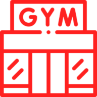

# [Light Gym](https://light-gym.netlify.app/) 
 
Website where one can browse exercises by different categories, with search functionality as well  
Can click on any exercise and visit the details page for that exercise, and can watch youtube videos there on how to properly perform the exercise  
Can see similar exercises as well on the exercise detail page   

Used [ExerciseDB API](https://rapidapi.com/justin-WFnsXH_t6/api/exercisedb) and [Youtube Search and Download API](https://rapidapi.com/h0p3rwe/api/youtube-search-and-download) on the [RapidAPI](https://rapidapi.com/) platform
  
Followed the [tutorial by Javascript Mastery](https://www.youtube.com/watch?v=KBpoBc98BwM)   
Tech Stack: Javascript, React, MaterialUI
